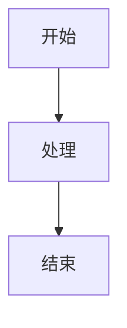

# Rematrix Server 文档

基于 VitePress 构建的现代化技术文档站点，提供完整的 API 接口、架构设计和开发指南。

## 🚀 快速开始

### 安装依赖

```bash
npm install
```

### 本地开发

```bash
npm run dev
```

访问 http://localhost:5173 查看文档。

### 构建生产版本

```bash
npm run build
```

### 预览构建结果

```bash
npm run preview
```

## 📁 文档结构

```
docs/
├── .vitepress/           # VitePress 配置
│   └── config.ts        # 主配置文件
├── api/                  # API 接口文档
│   ├── index.md         # API 概览
│   ├── jobs.md          # Jobs API
│   ├── artifacts.md     # Artifacts API
│   ├── workflow-engine.md # Workflow Engine API
│   └── chat-sse.md      # Chat SSE API
├── architecture/         # 架构设计文档
│   ├── index.md         # 架构概览
│   ├── nestjs.md        # NestJS 架构
│   └── temporal.md      # Temporal 工作流
├── index.md             # 首页
├── quick-start.md       # 快速开始
├── deployment.md        # 部署指南
├── summary.md           # 项目总结
└── README.md            # 本文件
```

## 🎯 主要功能

### 📡 API 文档
- 完整的 RESTful API 参考
- 请求/响应示例
- 错误处理指南
- 使用场景说明

### 🏗️ 架构设计
- NestJS 框架架构详解
- Temporal 工作流设计
- 数据库设计方案
- 性能优化策略

### 📖 开发指南
- 5分钟快速上手
- 环境搭建指南
- 生产部署方案
- 故障排查手册

## 🛠️ 技术栈

- **VitePress**: 静态站点生成器
- **Vue 3**: 前端框架
- **TypeScript**: 类型安全
- **Mermaid**: 图表渲染
- **Vite**: 构建工具

## 📝 文档编写

### 新增页面

1. 在相应目录下创建 `.md` 文件
2. 添加 Frontmatter 配置：

```markdown
---
title: 页面标题
description: 页面描述
---

# 页面内容
```

### 更新导航

编辑 `.vitepress/config.ts` 中的 `sidebar` 配置：

```typescript
sidebar: {
  '/api/': [
    {
      text: 'API 接口',
      items: [
        { text: '新API', link: '/api/new-api' }
      ]
    }
  ]
}
```

### 使用 Mermaid 图表

```markdown

```

## 🚢 部署

### GitHub Pages

```yaml
# .github/workflows/docs.yml
name: 部署文档

on:
  push:
    branches: [main]
    paths: ['docs/**']

jobs:
  deploy:
    runs-on: ubuntu-latest
    steps:
    - uses: actions/checkout@v3
    - name: 设置 Node.js
      uses: actions/setup-node@v3
      with:
        node-version: '20'
        cache: 'npm'
        cache-dependency-path: docs/package-lock.json
    - name: 安装依赖
      run: npm ci
      working-directory: ./docs
    - name: 构建文档
      run: npm run build
      working-directory: ./docs
    - name: 部署到 GitHub Pages
      uses: peaceiris/actions-gh-pages@v3
      with:
        github_token: ${{ secrets.GITHUB_TOKEN }}
        publish_dir: ./docs/.vitepress/dist
```

### Netlify

1. 连接 GitHub 仓库
2. 设置构建命令：`npm run build`
3. 设置发布目录：`docs/.vitepress/dist`
4. 添加环境变量（如需要）

### Vercel

1. 导入项目
2. 设置构建命令：`npm run build`
3. 设置输出目录：`docs/.vitepress/dist`
4. 自动部署

## 🔧 自定义配置

### 主题定制

在 `.vitepress/config.ts` 中自定义主题：

```typescript
export default defineConfig({
  themeConfig: {
    // 自定义导航
    nav: [
      { text: '首页', link: '/' },
      { text: 'API', link: '/api/' }
    ],
    
    // 自定义侧边栏
    sidebar: { /* ... */ },
    
    // 自定义页脚
    footer: {
      message: '基于 MIT 许可发布',
      copyright: `Copyright © ${new Date().getFullYear()} Rematrix Team`
    }
  }
})
```

### 添加插件

```bash
npm install -D vitepress-plugin-mermaid
```

在配置中使用：

```typescript
import { defineConfig } from 'vitepress'
import { MermaidPlugin } from "vitepress-plugin-mermaid"

export default defineConfig({
  markdown: {
    config: (md) => {
      md.use(MermaidPlugin)
    }
  }
})
```

## 📊 性能优化

### 图片优化

```markdown
<!-- 使用 WebP 格式 -->


<!-- 添加尺寸信息 -->
{width=300 height=200}
```

### 代码高亮

```markdown
```typescript{1,4-6}
// 行高亮
function example() {
  console.log('highlighted');
  return true;
}
```
```

## 🔍 搜索功能

VitePress 内置本地搜索，支持：

- 全文搜索
- 标题搜索
- 内容搜索
- 搜索结果高亮

## 📱 响应式设计

文档站点完全响应式，支持：

- 桌面端完整功能
- 平板端适配布局
- 移动端优化体验
- 暗色/亮色主题切换

## 🤝 贡献指南

1. Fork 项目
2. 创建功能分支
3. 编写或修改文档
4. 提交 Pull Request

### 文档规范

- 使用清晰的标题结构
- 提供代码示例
- 添加必要的注释
- 保持格式一致性

## 📄 许可证

MIT License - 详见 [LICENSE](../LICENSE) 文件

## 🆘 支持

如有问题，请：

1. 查看 [常见问题](./deployment.md#故障排查)
2. 搜索现有文档
3. 提交 Issue
4. 联系维护团队

---

🎉 **感谢使用 Rematrix Server 文档！**
