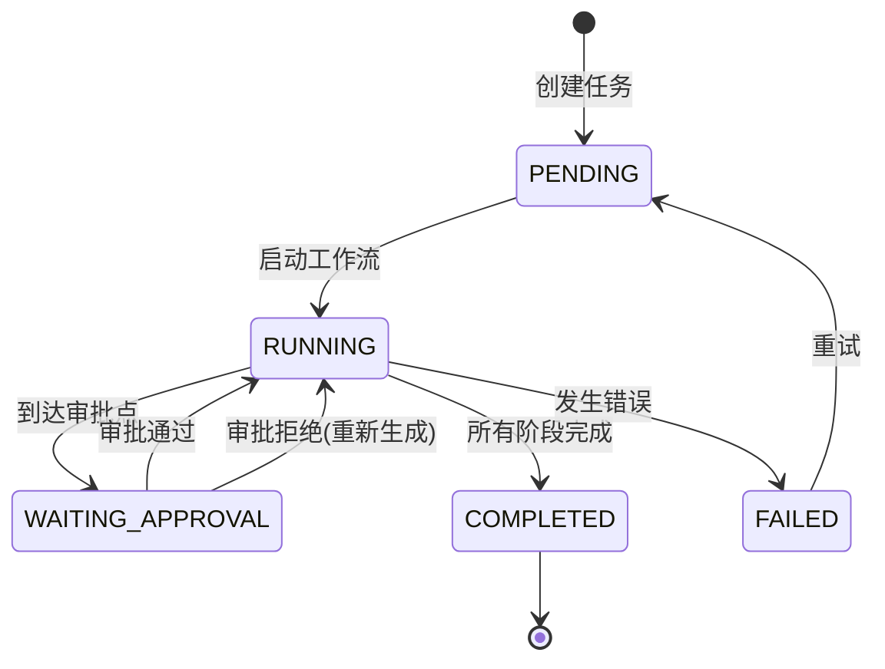

# Jobs API

任务管理接口，负责创建、查询、运行和审批视频生成任务。

## 概述

Jobs API 是 Rematrix Server 的核心接口，管理整个视频生成流程的生命周期。每个 Job 代表一次完整的 Markdown 到视频的转换过程。

## 基础信息

- **Base URL**: `http://localhost:3000`
- **Content-Type**: `application/json`
- **认证方式**: 暂无（开发阶段）

## 接口列表

### 1. 获取任务列表

获取所有任务的简要信息。

```http
GET /jobs
```

**响应示例**:
```json
{
  "jobs": [
    {
      "id": "job_123456789",
      "status": "RUNNING",
      "currentStage": "NARRATION",
      "createdAt": "2025-12-21T10:00:00Z",
      "updatedAt": "2025-12-21T10:30:00Z"
    }
  ]
}
```

**状态说明**:
- `PENDING`: 待启动
- `RUNNING`: 运行中
- `WAITING_APPROVAL`: 等待审批
- `COMPLETED`: 已完成
- `FAILED`: 失败

---

### 2. 创建新任务

创建一个新的视频生成任务。

```http
POST /jobs
```

**请求体**:
```json
{
  "content": "# 标题\n\n这是一个示例文档...",
  "style": "可选风格",
  "language": "可选语言"
}
```

**参数说明**:
- `content` (string, 必填): 要转换的 Markdown 内容
- `style` (string, 可选): 视频风格配置
- `language` (string, 可选): 语言设置

**响应示例**:
```json
{
  "jobId": "job_123456789"
}
```

**代码逻辑说明**:
```typescript
// JobsController.create()
async create(@Body() dto: CreateJobDto) {
  // 1. 验证 Markdown 内容
  // 2. 创建 Job 记录到数据库
  // 3. 初始化状态为 PENDING
  // 4. 返回 Job ID
  const job = await this.jobs.create(dto);
  return { jobId: job.id };
}
```

---

### 3. 查询任务详情

获取指定任务的完整信息。

```http
GET /jobs/{id}
```

**路径参数**:
- `id` (string): 任务 ID

**响应示例**:
```json
{
  "id": "job_123456789",
  "status": "RUNNING",
  "currentStage": "NARRATION",
  "config": {
    "content": "# 标题\n\n这是一个示例文档...",
    "style": "可选风格",
    "language": "可选语言"
  },
  "createdAt": "2025-12-21T10:00:00Z",
  "updatedAt": "2025-12-21T10:30:00Z",
  "completedAt": null,
  "error": null
}
```

**代码逻辑说明**:
```typescript
// JobsService.get()
async get(id: string) {
  // 1. 从数据库查询 Job
  // 2. 包含配置和状态信息
  // 3. 返回完整任务信息
  return await this.prisma.job.findUnique({
    where: { id },
    include: { artifacts: true }
  });
}
```

---

### 4. 启动任务

启动指定任务的工作流执行。

```http
POST /jobs/{id}/run
```

**路径参数**:
- `id` (string): 任务 ID

**响应示例**:
```json
{
  "success": true,
  "workflowId": "workflow_abc123",
  "message": "任务已启动"
}
```

**代码逻辑说明**:
```typescript
// JobsService.run()
async run(id: string) {
  // 1. 检查任务状态（必须是 PENDING）
  // 2. 连接到 Temporal Server
  // 3. 启动 videoGenerationWorkflow
  // 4. 更新任务状态为 RUNNING
  const handle = await this.temporalClient.startWorkflow({
    workflowId: `video-generation-${id}`,
    workflowType: videoGenerationWorkflow,
    args: [{ jobId: id }]
  });
  
  await this.updateStatus(id, 'RUNNING');
  return { success: true, workflowId: handle.workflowId };
}
```

---

### 5. 审批通过

批准当前阶段的产物，继续执行下一阶段。

```http
POST /jobs/{id}/approve
```

**路径参数**:
- `id` (string): 任务 ID

**请求体**:
```json
{
  "stage": "PLAN",
  "comment": "计划看起来不错，继续执行"
}
```

**参数说明**:
- `stage` (string, 必填): 审批阶段 (`PLAN|NARRATION|PAGES`)
- `comment` (string, 可选): 审批意见

**响应示例**:
```json
{
  "success": true,
  "message": "阶段已批准，工作流将继续执行"
}
```

**代码逻辑说明**:
```typescript
// JobsService.approve()
async approve(id: string, stage: string, comment?: string) {
  // 1. 验证任务状态（必须是 WAITING_APPROVAL）
  // 2. 发送 approveStage 信号到 Temporal
  // 3. 记录审批历史
  // 4. 等待工作流继续执行
  await this.temporalClient.signalWorkflow({
    workflowId: `video-generation-${id}`,
    signalName: 'approveStage',
    args: [{ stage }]
  });
  
  await this.createApproval(id, stage, 'APPROVED', comment);
  return { success: true };
}
```

---

### 6. 审批拒绝

拒绝当前阶段的产物，可能需要重新生成。

```http
POST /jobs/{id}/reject
```

**路径参数**:
- `id` (string): 任务 ID

**请求体**:
```json
{
  "stage": "PLAN",
  "reason": "计划不够详细，需要补充更多内容",
  "comment": "请重新生成包含具体示例的计划"
}
```

**参数说明**:
- `stage` (string, 必填): 拒绝阶段 (`PLAN|NARRATION|PAGES`)
- `reason` (string, 必填): 拒绝原因
- `comment` (string, 可选): 详细说明

**响应示例**:
```json
{
  "success": true,
  "message": "阶段已拒绝，将重新生成"
}
```

**代码逻辑说明**:
```typescript
// JobsService.reject()
async reject(id: string, stage: string, reason: string, comment?: string) {
  // 1. 验证任务状态
  // 2. 发送 rejectStage 信号到 Temporal
  // 3. 记录拒绝原因和历史
  // 4. 工作流将重新执行当前阶段
  await this.temporalClient.signalWorkflow({
    workflowId: `video-generation-${id}`,
    signalName: 'rejectStage',
    args: [{ stage, reason }]
  });
  
  await this.createApproval(id, stage, 'REJECTED', reason, comment);
  return { success: true };
}
```

---

## 错误处理

### 常见错误码

| 状态码 | 说明 | 示例 |
|--------|------|------|
| 400 | 请求参数错误 | `{"message": "stage must be one of: PLAN, NARRATION, PAGES"}` |
| 404 | 任务不存在 | `{"message": "Job not found"}` |
| 409 | 任务状态冲突 | `{"message": "Job is not in PENDING status"}` |
| 500 | 服务器内部错误 | `{"message": "Internal server error"}` |

### 错误响应格式

```json
{
  "error": {
    "code": "INVALID_STAGE",
    "message": "stage must be one of: PLAN, NARRATION, PAGES",
    "details": {
      "received": "INVALID",
      "allowed": ["PLAN", "NARRATION", "PAGES"]
    }
  }
}
```

---

## 使用示例

### 完整的任务创建和执行流程

```typescript
// 1. 创建任务
const createResponse = await fetch('http://localhost:3000/jobs', {
  method: 'POST',
  headers: { 'Content-Type': 'application/json' },
  body: JSON.stringify({
    content: `
# 深度学习入门

## 基础概念
深度学习是机器学习的一个分支...

## 神经网络
神经网络的基本结构包括...
      `.trim(),
    style: "Google 风格",
    language: "zh-CN"
  })
});

const { jobId } = await createResponse.json();

// 2. 启动任务
await fetch(`http://localhost:3000/jobs/${jobId}/run`, {
  method: 'POST'
});

// 3. 轮询任务状态
const checkStatus = async () => {
  const response = await fetch(`http://localhost:3000/jobs/${jobId}`);
  const job = await response.json();
  
  console.log(`任务状态: ${job.status}, 当前阶段: ${job.currentStage}`);
  
  if (job.status === 'WAITING_APPROVAL') {
    console.log('等待审批，可以查看产物并进行审批');
  }
  
  return job;
};

// 定期检查状态
setInterval(checkStatus, 5000);
```

---

## 技术细节

### 数据模型

```typescript
interface Job {
  id: string;
  status: 'PENDING' | 'RUNNING' | 'WAITING_APPROVAL' | 'COMPLETED' | 'FAILED';
  currentStage: 'PLAN' | 'OUTLINE' | 'NARRATION' | 'PAGES' | 'RENDER' | 'MERGE' | 'DONE';
  config: {
    content: string;
    style?: string;
    language?: string;
  };
  createdAt: Date;
  updatedAt: Date;
  completedAt: Date | null;
  error: string | null;
}
```

### 审批流程

1. 工作流执行到审批阶段时暂停
2. 任务状态变为 `WAITING_APPROVAL`
3. 用户查看产物并决定批准或拒绝
4. 通过 API 发送审批决定
5. 工作流收到信号后继续执行或重新生成

### 状态转换图



---

*相关文档*: [Artifacts API](./artifacts.md) | [Workflow Engine API](./workflow-engine.md) | [Chat SSE API](./chat-sse.md)
