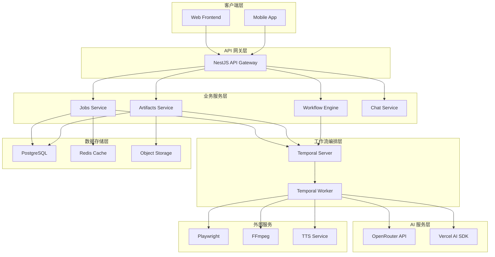
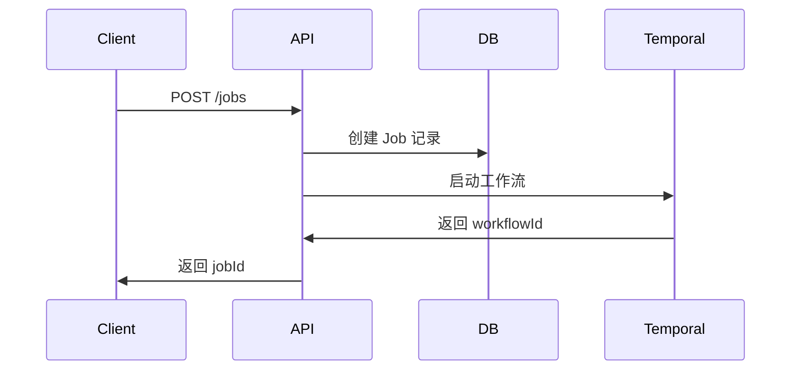
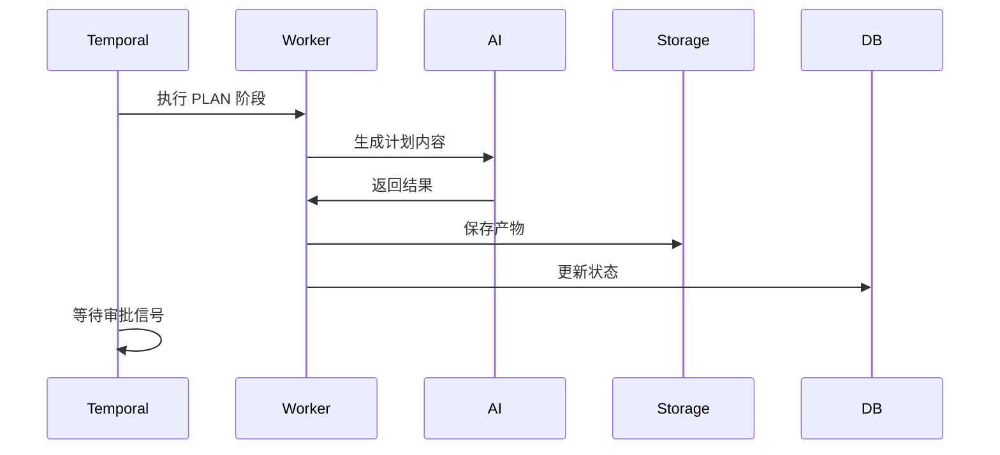
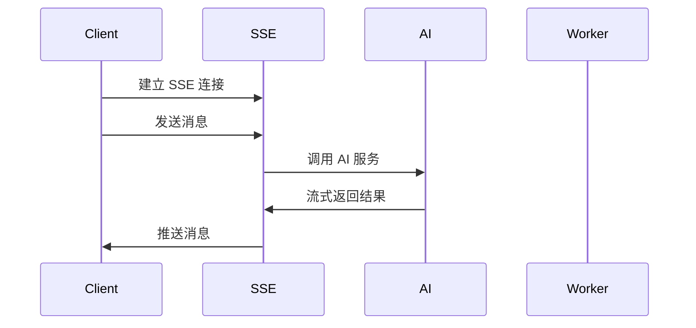

# 架构设计概览

Rematrix Server 采用现代化的微服务架构，基于 NestJS + Temporal + AI 技术栈构建，提供可靠的视频生成工作流编排能力。

## 🏗️ 系统架构



## 🎯 核心设计原则

### 1. 可靠性 (Reliability)
- **持久化执行**: Temporal 确保工作流状态不丢失
- **错误恢复**: 自动重试和人工干预机制
- **数据一致性**: 事务性操作和状态同步

### 2. 可扩展性 (Scalability)
- **水平扩展**: 支持多实例部署
- **异步处理**: 非阻塞的任务执行
- **资源隔离**: 独立的 Worker 进程

### 3. 可观测性 (Observability)
- **全链路追踪**: 请求ID和工作流ID关联
- **实时监控**: Temporal UI 和自定义指标
- **结构化日志**: 便于问题排查和分析

### 4. 可维护性 (Maintainability)
- **模块化设计**: 清晰的职责分离
- **类型安全**: TypeScript 和 JSDoc 注释
- **文档完善**: API 文档和架构说明

## 📦 技术栈详解

### 后端框架
- **NestJS 11**: 企业级 Node.js 框架
  - 模块化架构
  - 依赖注入
  - 装饰器生态
  - 中间件支持

### 工作流编排
- **Temporal**: 持久化执行引擎
  - 工作流定义 (Workflow)
  - 活动执行 (Activities)
  - 信号通信 (Signals)
  - 状态查询 (Queries)

### 数据存储
- **PostgreSQL**: 主数据库
  - 任务和产物存储
  - 事务性操作
  - 复杂查询支持
- **Redis**: 缓存层
  - 会话存储
  - 临时数据
  - 分布式锁

### AI 集成
- **OpenRouter**: AI 模型网关
- **Vercel AI SDK**: AI 工具库
- **流式处理**: 实时内容生成

### 对象存储
- **Bunny Storage**: CDN 加速
- **本地存储**: 开发环境降级
- **多策略支持**: 自动切换和备份

## 🔄 数据流设计

### 1. 任务创建流程


### 2. 工作流执行流程


### 3. 实时通信流程


## 🛡️ 安全设计

### 1. 认证授权
```typescript
// JWT Token 验证
@Injectable()
export class AuthGuard implements CanActivate {
  canActivate(context: ExecutionContext): boolean {
    const request = context.switchToHttp().getRequest();
    const token = request.headers.authorization?.replace('Bearer ', '');
    
    return this.validateToken(token);
  }
}
```

### 2. 输入验证
```typescript
// DTO 验证
export class CreateJobDto {
  @IsString()
  @IsNotEmpty()
  @MaxLength(100000)
  markdown: string;
  
  @IsOptional()
  @IsNumber()
  @Min(60)
  @Max(3600)
  targetDurationSec?: number;
}
```

### 3. 权限控制
```typescript
// 基于角色的访问控制
@Roles(Role.ADMIN, Role.USER)
@Post('/jobs')
async createJob(@Body() dto: CreateJobDto) {
  // 业务逻辑
}
```

## 📊 性能优化

### 1. 数据库优化
```sql
-- 索引优化
CREATE INDEX idx_jobs_status ON jobs(status);
CREATE INDEX idx_jobs_created_at ON jobs(created_at DESC);
CREATE INDEX idx_artifacts_job_stage ON artifacts(job_id, stage);
```

### 2. 缓存策略
```typescript
// Redis 缓存
@Injectable()
export class CacheService {
  async get<T>(key: string): Promise<T | null> {
    const value = await this.redis.get(key);
    return value ? JSON.parse(value) : null;
  }
  
  async set(key: string, value: any, ttl = 300): Promise<void> {
    await this.redis.setex(key, ttl, JSON.stringify(value));
  }
}
```

### 3. 连接池管理
```typescript
// 数据库连接池
const prisma = new PrismaClient({
  datasources: {
    db: {
      url: process.env.DATABASE_URL,
    },
  },
  log: ['query', 'info', 'warn', 'error'],
});
```

## 🔧 监控和运维

### 1. 健康检查
```typescript
@Controller('health')
export class HealthController {
  @Get()
  async check() {
    return {
      status: 'ok',
      timestamp: new Date().toISOString(),
      services: {
        database: await this.checkDatabase(),
        temporal: await this.checkTemporal(),
        redis: await this.checkRedis(),
      },
    };
  }
}
```

### 2. 指标收集
```typescript
// Prometheus 指标
import { Counter, Histogram } from 'prom-client';

export const metrics = {
  requestsTotal: new Counter({
    name: 'http_requests_total',
    help: 'Total HTTP requests',
    labelNames: ['method', 'route', 'status'],
  }),
  
  requestDuration: new Histogram({
    name: 'http_request_duration_seconds',
    help: 'HTTP request duration',
    labelNames: ['method', 'route'],
  }),
};
```

### 3. 日志聚合
```typescript
// 结构化日志
import { Logger } from 'winston';

export const logger = new Logger({
  format: winston.format.combine(
    winston.format.timestamp(),
    winston.format.errors({ stack: true }),
    winston.format.json(),
  ),
  transports: [
    new winston.transports.Console(),
    new winston.transports.File({ filename: 'app.log' }),
  ],
});
```

## 🚀 部署架构

### 1. 容器化部署
```dockerfile
# Dockerfile
FROM node:20-alpine

WORKDIR /app
COPY package*.json ./
RUN npm ci --only=production

COPY . .
RUN npm run build

EXPOSE 3000
CMD ["npm", "start"]
```

### 2. Kubernetes 部署
```yaml
# deployment.yaml
apiVersion: apps/v1
kind: Deployment
metadata:
  name: rematrix-server
spec:
  replicas: 3
  selector:
    matchLabels:
      app: rematrix-server
  template:
    metadata:
      labels:
        app: rematrix-server
    spec:
      containers:
      - name: app
        image: rematrix-server:latest
        ports:
        - containerPort: 3000
        env:
        - name: DATABASE_URL
          valueFrom:
            secretKeyRef:
              name: db-secret
              key: url
```

### 3. 负载均衡
```nginx
# nginx.conf
upstream rematrix {
  server app1:3000;
  server app2:3000;
  server app3:3000;
}

server {
  listen 80;
  location / {
    proxy_pass http://rematrix;
    proxy_set_header Host $host;
    proxy_set_header X-Real-IP $remote_addr;
  }
}
```

---

📖 **下一步**: 查看具体的架构模块文档
- [NestJS 架构详解](./nestjs.md)
- [Temporal 工作流详解](./temporal.md)
