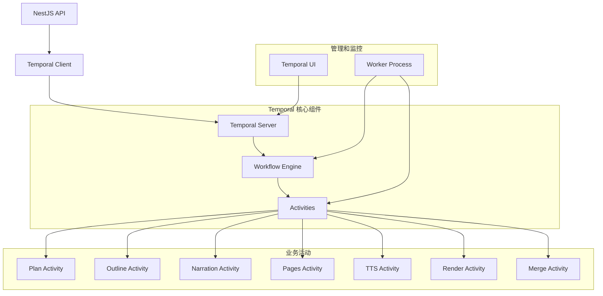

# Temporal 工作流架构

基于 Temporal 的分布式工作流编排系统，负责视频生成流程的状态管理、任务调度和错误处理。

## 概述

Temporal 是一个 durable execution 平台，为 Rematrix Server 提供可靠的工作流编排能力。它确保视频生成的复杂流程能够正确执行，支持暂停、恢复、重试和人工干预。

## 架构组件



---

## 核心概念

### 1. Workflow（工作流）

工作流定义了视频生成的完整流程，包含状态管理、信号处理和错误恢复。

```typescript
// src/temporal/workflows/video-generation.workflow.ts
export async function videoGenerationWorkflow(input: VideoGenerationInput) {
  const { jobId } = input;
  
  // 审批状态管理
  const approved: Record<string, boolean> = {
    PLAN: false,
    NARRATION: false,
    PAGES: false,
  };
  
  const rejected: Record<string, boolean> = {
    PLAN: false,
    NARRATION: false,
    PAGES: false,
  };

  // 信号处理器
  setHandler(approveStage, (payload) => {
    if (payload.stage in approved) {
      approved[payload.stage] = true;
      rejected[payload.stage] = false;
    }
  });

  setHandler(rejectStage, (payload) => {
    if (payload.stage in rejected) {
      approved[payload.stage] = false;
      rejected[payload.stage] = true;
      rejectedReason[payload.stage] = payload.reason;
    }
  });

  // 执行流程
  await runPlanStage(input);
  await waitForStageApproval('PLAN');
  
  await runOutlineStage(input);
  await runStoryboardStage(input);
  
  await runNarrationStage(input);
  await waitForStageApproval('NARRATION');
  
  await runPagesStage(input);
  await waitForStageApproval('PAGES');
  
  await runTtsStage(input);
  await runRenderStage(input);
  await runMergeStage(input);
  
  await markJobCompleted(jobId);
  
  return { jobId, nextStage: 'DONE' };
}
```

### 2. Activities（活动）

活动是工作流中的具体执行单元，负责实际的业务逻辑处理。

```typescript
// src/temporal/activities/video-generation.activities.ts
export const runPlanStage = async (input: VideoGenerationInput) => {
  const { jobId } = input;
  
  // 1. 更新任务状态
  await updateJobStage(jobId, 'PLAN');
  
  // 2. 获取 Markdown 内容
  const job = await getJobById(jobId);
  const markdown = job.config?.markdown || '';
  
  // 3. 调用 AI 生成计划
  const planPrompt = await buildPlanPrompt(markdown);
  const planResult = await callAI(planPrompt);
  
  // 4. 解析和验证结果
  const plan = parsePlanResult(planResult);
  
  // 5. 保存产物
  await createArtifact({
    jobId,
    stage: 'PLAN',
    type: 'plan',
    content: plan,
  });
  
  // 6. 更新状态为等待审批
  await updateJobStatus(jobId, 'WAITING_APPROVAL');
  
  return plan;
};

export const runNarrationStage = async (input: VideoGenerationInput) => {
  const { jobId } = input;
  
  await updateJobStage(jobId, 'NARRATION');
  
  // 获取前置产物
  const storyboard = await getArtifact(jobId, 'STORYBOARD');
  
  // 生成口播稿
  const narrationPrompt = await buildNarrationPrompt(storyboard.content);
  const narrationResult = await callAI(narrationPrompt);
  const narration = parseNarrationResult(narrationResult);
  
  // 保存产物
  await createArtifact({
    jobId,
    stage: 'NARRATION',
    type: 'narration',
    content: narration,
  });
  
  await updateJobStatus(jobId, 'WAITING_APPROVAL');
  
  return narration;
};
```

### 3. Signals（信号）

信号用于从外部与运行中的工作流进行通信，实现实时控制和干预。

```typescript
// 信号定义
const approveStage = defineSignal<[payload: { stage: string }]>('approveStage');
const rejectStage = defineSignal<[payload: { stage: string; reason?: string }]>('rejectStage');
const skipStage = defineSignal<[payload: { stage: string; reason?: string }]>('skipStage');
const retryStage = defineSignal<[payload: { stage: string; params?: any }]>('retryStage');

// 信号处理逻辑
async function waitForStageApproval(stage: 'PLAN' | 'NARRATION' | 'PAGES') {
  while (true) {
    await condition(
      () => approved[stage] === true || rejected[stage] === true,
    );

    if (rejected[stage]) {
      // 拒绝处理
      await markStageRejected(jobId, stage, rejectedReason[stage]);
      rejected[stage] = false;
      rejectedReason[stage] = undefined;
      continue; // 重新等待
    }

    if (approved[stage]) {
      // 批准处理
      break;
    }
  }

  await markStageApproved(jobId, stage);
}
```

---

## Worker 架构

### Worker 进程设计

```typescript
// src/temporal/worker.ts
async function runWorker() {
  const worker = await Worker.create({
    workflowsPath: require.resolve('./workflows'),
    activities,
    taskQueue: process.env.TEMPORAL_TASK_QUEUE || 'rematrix-video',
    
    // 配置选项
    maxConcurrentActivityExecutionSize: 5,
    maxConcurrentWorkflowTaskExecutionSize: 100,
    
    // 错误处理
    stalledWorkflowTimeout: '10 minutes',
    
    // 指标和监控
    enableLogging: true,
  });

  console.log('Worker 启动成功，监听队列:', worker.taskQueue);
  
  await worker.run();
}

// 启动 Worker
if (require.main === module) {
  runWorker().catch((err) => {
    console.error('Worker 启动失败:', err);
    process.exit(1);
  });
}
```

### Activity 注册

```typescript
// src/temporal/activities/index.ts
export const activities = {
  // 阶段执行活动
  runPlanStage,
  runOutlineStage,
  runStoryboardStage,
  runNarrationStage,
  runPagesStage,
  runTtsStage,
  runRenderStage,
  runMergeStage,
  
  // 状态管理活动
  markStageApproved,
  markStageRejected,
  updateJobStage,
  updateJobStatus,
  markJobCompleted,
  
  // 工具活动
  createArtifact,
  getArtifact,
  callAI,
  uploadToStorage,
};

// Activity 配置
export const activityOptions = {
  startToCloseTimeout: '10 minutes',
  heartbeatTimeout: '2 minutes',
  retryPolicy: {
    maximumAttempts: 3,
    initialInterval: '1 second',
    maximumInterval: '30 seconds',
    backoffCoefficient: 2,
  },
};
```

---

## 状态管理

### 工作流状态模型

```typescript
// 工作流状态接口
interface WorkflowState {
  jobId: string;
  currentStage: Stage;
  status: WorkflowStatus;
  approvedStages: string[];
  rejectedStages: string[];
  stageHistory: StageHistory[];
  error?: WorkflowError;
}

// 阶段历史
interface StageHistory {
  stage: string;
  status: 'STARTED' | 'COMPLETED' | 'FAILED' | 'SKIPPED';
  startTime: Date;
  endTime?: Date;
  error?: string;
  retryCount?: number;
}

// 状态转换
enum WorkflowStatus {
  PENDING = 'PENDING',
  RUNNING = 'RUNNING',
  WAITING_APPROVAL = 'WAITING_APPROVAL',
  PAUSED = 'PAUSED',
  COMPLETED = 'COMPLETED',
  FAILED = 'FAILED',
  CANCELLED = 'CANCELLED',
}
```

### 状态持久化

```typescript
// 状态持久化活动
export const updateJobStage = async (jobId: string, stage: string) => {
  await prisma.job.update({
    where: { id: jobId },
    data: {
      currentStage: stage,
      status: 'RUNNING',
      updatedAt: new Date(),
    },
  });
  
  // 记录阶段历史
  await prisma.stageHistory.create({
    data: {
      jobId,
      stage,
      status: 'STARTED',
      startTime: new Date(),
    },
  });
};

export const markStageCompleted = async (jobId: string, stage: string) => {
  await prisma.stageHistory.updateMany({
    where: {
      jobId,
      stage,
      status: 'STARTED',
    },
    data: {
      status: 'COMPLETED',
      endTime: new Date(),
    },
  });
};
```

---

## 错误处理和重试

### Activity 重试策略

```typescript
// 自定义重试策略
const retryPolicy = {
  initialInterval: '1 second',
  maximumInterval: '30 seconds',
  backoffCoefficient: 2,
  maximumAttempts: 3,
  
  // 非重试错误
  nonRetryableErrorTypes: [
    'ValidationError',
    'AuthenticationError',
    'PermissionError',
  ],
};

// Activity 错误处理
export const runNarrationStage = async (input: VideoGenerationInput) => {
  try {
    // 业务逻辑
    const result = await generateNarration(input);
    return result;
  } catch (error) {
    // 根据错误类型决定是否重试
    if (error instanceof ValidationError) {
      throw new ApplicationFailure(
        '验证失败',
        'ValidationError',
        false, // 非重试
        error.details
      );
    }
    
    if (error instanceof RateLimitError) {
      throw new ApplicationFailure(
        'API 限流',
        'RateLimitError',
        true, // 可重试
        { retryAfter: error.retryAfter }
      );
    }
    
    throw error;
  }
};
```

### 工作流级错误处理

```typescript
// 工作流错误处理
export async function videoGenerationWorkflow(input: VideoGenerationInput) {
  const { jobId } = input;
  
  try {
    // 主要流程
    await executeWorkflowStages(input);
    
  } catch (error) {
    // 错误分类处理
    if (error instanceof ApplicationFailure) {
      switch (error.type) {
        case 'ValidationError':
          await handleValidationError(jobId, error);
          break;
          
        case 'RateLimitError':
          await handleRateLimitError(jobId, error);
          break;
          
        case 'ResourceError':
          await handleResourceError(jobId, error);
          break;
          
        default:
          await handleUnknownError(jobId, error);
      }
    }
    
    // 更新任务状态
    await updateJobStatus(jobId, 'FAILED', error.message);
    
    // 决定是否重试整个工作流
    if (shouldRetryWorkflow(error)) {
      throw error; // Temporal 会自动重试
    }
  }
}

// 错误处理函数
async function handleValidationError(jobId: string, error: ApplicationFailure) {
  // 记录错误详情
  await createErrorLog(jobId, {
    type: 'VALIDATION_ERROR',
    message: error.message,
    details: error.details,
  });
  
  // 发送通知
  await sendNotification(jobId, {
    type: 'ERROR',
    message: '输入验证失败，请检查 Markdown 格式',
  });
}
```

---

## 信号和查询

### 自定义信号

```typescript
// 跳过阶段信号
const skipStage = defineSignal<[payload: { stage: string; reason?: string }]>('skipStage');

// 暂停工作流信号
const pauseWorkflow = defineSignal<[payload: { reason?: string }]>('pauseWorkflow');

// 恢复工作流信号
const resumeWorkflow = defineSignal('resumeWorkflow');

// 修改参数信号
const modifyStageParams = defineSignal<[payload: { stage: string; params: any }]>('modifyStageParams');

// 信号处理
setHandler(skipStage, async (payload) => {
  const { stage, reason } = payload;
  
  // 记录跳过原因
  await createStageNote(jobId, stage, 'SKIPPED', reason);
  
  // 设置跳过标记
  skippedStages[stage] = true;
  
  // 如果当前正在执行该阶段，立即跳过
  if (currentStage === stage) {
    await moveToNextStage();
  }
});
```

### 工作流查询

```typescript
// 查询定义
export const getWorkflowStatus = defineQuery<[jobId: string], WorkflowStatus>('getWorkflowStatus');
export const getCurrentStage = defineQuery<[jobId: string], string>('getCurrentStage');
export const getStageHistory = defineQuery<[jobId: string], StageHistory[]>('getStageHistory');

// 查询处理
setHandler(getWorkflowStatus, () => workflowStatus);
setHandler(getCurrentStage, () => currentStage);
setHandler(getStageHistory, () => stageHistory);

// 客户端查询使用
async function queryWorkflowStatus(workflowId: string) {
  const client = new TemporalClient();
  const handle = client.getWorkflowHandle(workflowId);
  
  const status = await handle.query(getWorkflowStatus, workflowId);
  const currentStage = await handle.query(getCurrentStage, workflowId);
  const history = await handle.query(getStageHistory, workflowId);
  
  return { status, currentStage, history };
}
```

---

## 性能优化

### 并发控制

```typescript
// Worker 并发配置
const worker = await Worker.create({
  taskQueue: 'rematrix-video',
  
  // 并发控制
  maxConcurrentActivityExecutionSize: 5, // 最大并发活动数
  maxConcurrentWorkflowTaskExecutionSize: 100, // 最大并发工作流任务数
  
  // 资源限制
  maxConcurrentLocalActivityExecutionSize: 10,
  
  // 调度策略
  defaultWorkflowTaskQueueScheduleToStartTimeout: '10 seconds',
  defaultActivityScheduleToCloseTimeout: '5 minutes',
});

// Activity 级别并发控制
export const runRenderStage = async (input: VideoGenerationInput) => {
  // 获取信号量
  const semaphore = await acquireRenderSemaphore();
  
  try {
    const result = await performRender(input);
    return result;
  } finally {
    // 释放信号量
    await releaseRenderSemaphore(semaphore);
  }
};
```

### 缓存和批处理

```typescript
// 结果缓存
const workflowCache = new Map<string, any>();

export const cachedCallAI = async (prompt: string): Promise<any> => {
  const cacheKey = hashPrompt(prompt);
  
  if (workflowCache.has(cacheKey)) {
    return workflowCache.get(cacheKey);
  }
  
  const result = await callAI(prompt);
  workflowCache.set(cacheKey, result);
  
  return result;
};

// 批量操作
export const batchCreateArtifacts = async (artifacts: ArtifactData[]) => {
  return await prisma.artifact.createMany({
    data: artifacts,
    skipDuplicates: true,
  });
};
```

---

## 监控和调试

### 工作流监控

```typescript
// 监控指标收集
export class WorkflowMetrics {
  private static metrics = {
    workflowStarted: 0,
    workflowCompleted: 0,
    workflowFailed: 0,
    activityCompleted: 0,
    activityFailed: 0,
    averageExecutionTime: 0,
  };

  static recordWorkflowStart() {
    this.metrics.workflowStarted++;
  }

  static recordWorkflowComplete(duration: number) {
    this.metrics.workflowCompleted++;
    this.updateAverageTime(duration);
  }

  static recordWorkflowFailure() {
    this.metrics.workflowFailed++;
  }

  static getMetrics() {
    return { ...this.metrics };
  }

  private static updateAverageTime(duration: number) {
    const total = this.metrics.workflowCompleted * this.metrics.averageExecutionTime + duration;
    this.metrics.averageExecutionTime = total / this.metrics.workflowCompleted;
  }
}

// 在工作流中使用
export async function videoGenerationWorkflow(input: VideoGenerationInput) {
  const startTime = Date.now();
  
  WorkflowMetrics.recordWorkflowStart();
  
  try {
    await executeWorkflowStages(input);
    
    const duration = Date.now() - startTime;
    WorkflowMetrics.recordWorkflowComplete(duration);
    
  } catch (error) {
    WorkflowMetrics.recordWorkflowFailure();
    throw error;
  }
}
```

### 调试工具

```typescript
// 工作流调试器
export class WorkflowDebugger {
  private static debugMode = process.env.TEMPORAL_DEBUG === 'true';
  
  static log(message: string, data?: any) {
    if (this.debugMode) {
      console.log(`[Workflow Debug] ${message}`, data);
    }
  }
  
  static async dumpWorkflowState(jobId: string) {
    const state = await getWorkflowState(jobId);
    
    this.log('Workflow State Dump', {
      jobId,
      currentStage: state.currentStage,
      status: state.status,
      approvedStages: state.approvedStages,
      rejectedStages: state.rejectedStages,
      stageHistory: state.stageHistory,
    });
    
    return state;
  }
}

// Temporal UI 集成
export const getTemporalUIUrl = () => {
  const address = process.env.TEMPORAL_ADDRESS || 'localhost:7233';
  const [host, port] = address.split(':');
  return `http://${host}:8233`; // 默认 UI 端口
};
```

---

## 部署和运维

### 配置管理

```typescript
// 生产环境配置
const productionConfig = {
  temporal: {
    address: process.env.TEMPORAL_ADDRESS,
    namespace: process.env.TEMPORAL_NAMESPACE,
    taskQueue: process.env.TEMPORAL_TASK_QUEUE,
    
    // 连接池
    connectionOptions: {
      tls: process.env.NODE_ENV === 'production',
      maxConnectionCount: 10,
    },
    
    // 工作流选项
    workflowExecutionTimeout: '24 hours',
    workflowRunTimeout: '23 hours',
    workflowTaskTimeout: '10 seconds',
  },
  
  worker: {
    maxConcurrentActivityExecutionSize: 10,
    maxConcurrentWorkflowTaskExecutionSize: 200,
    
    // 资源限制
    maxMemoryUsage: '1GB',
    maxCpuUsage: 80,
  },
};
```

### 健康检查

```typescript
// Worker 健康检查
export class WorkerHealthChecker {
  private static isHealthy = true;
  private static lastCheck = new Date();
  
  static async checkHealth() {
    try {
      // 检查 Temporal 连接
      const client = new TemporalClient();
      await client.connection.health();
      
      // 检查任务队列
      const worker = await Worker.create({
        taskQueue: 'health-check',
        workflowsPath: require.resolve('./workflows'),
      });
      
      this.isHealthy = true;
      this.lastCheck = new Date();
      
      return {
        healthy: true,
        timestamp: this.lastCheck,
        version: process.env.APP_VERSION || 'unknown',
      };
      
    } catch (error) {
      this.isHealthy = false;
      
      return {
        healthy: false,
        error: error.message,
        timestamp: new Date(),
      };
    }
  }
  
  static getStatus() {
    return {
      healthy: this.isHealthy,
      lastCheck: this.lastCheck,
    };
  }
}
```

---

## 总结

Temporal 工作流架构为 Rematrix Server 提供了：

1. **可靠性**: 持久化执行状态，确保流程不丢失
2. **可观测性**: 完整的执行历史和状态追踪
3. **灵活性**: 支持暂停、恢复、重试和人工干预
4. **可扩展性**: 水平扩展和高并发处理能力
5. **容错性**: 自动重试和错误恢复机制

这种架构设计确保了复杂的视频生成流程能够稳定、可靠地执行，同时提供了强大的监控和调试能力。

---

*相关文档*: [NestJS 架构](./nestjs.md) | [数据库设计](./database.md) | [工作流流程](../workflows/video-generation.md)
