# Mermaid 图表使用指南

本指南介绍如何在 Rematrix Server 文档中使用 Mermaid 图表来可视化流程、架构和关系。

## 🎯 支持的图表类型

### 1. 流程图 (Flowchart)

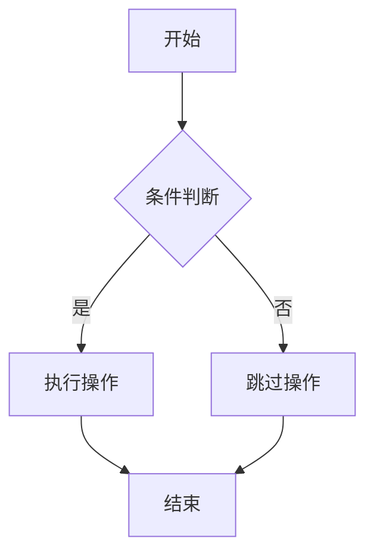

### 2. 序列图 (Sequence Diagram)

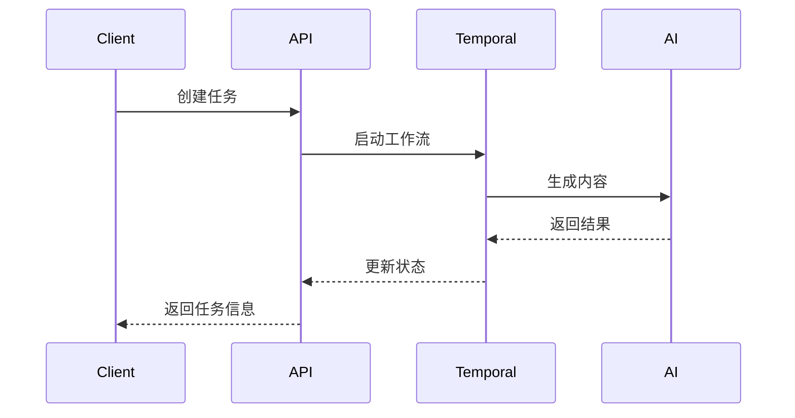

### 3. 架构图 (Architecture Diagram)

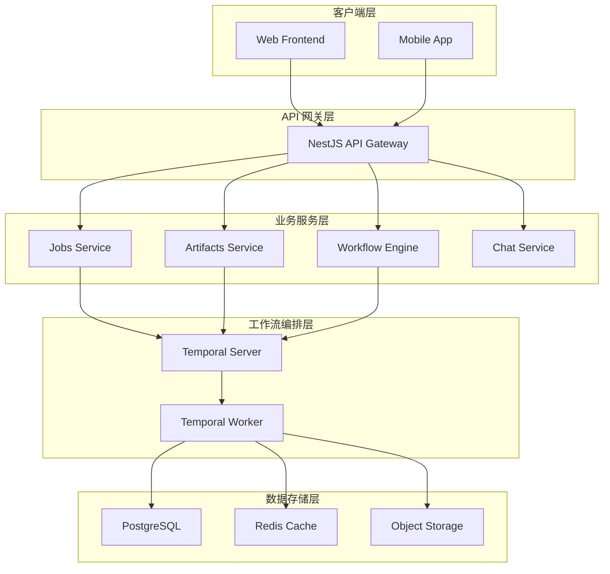

### 4. 状态图 (State Diagram)

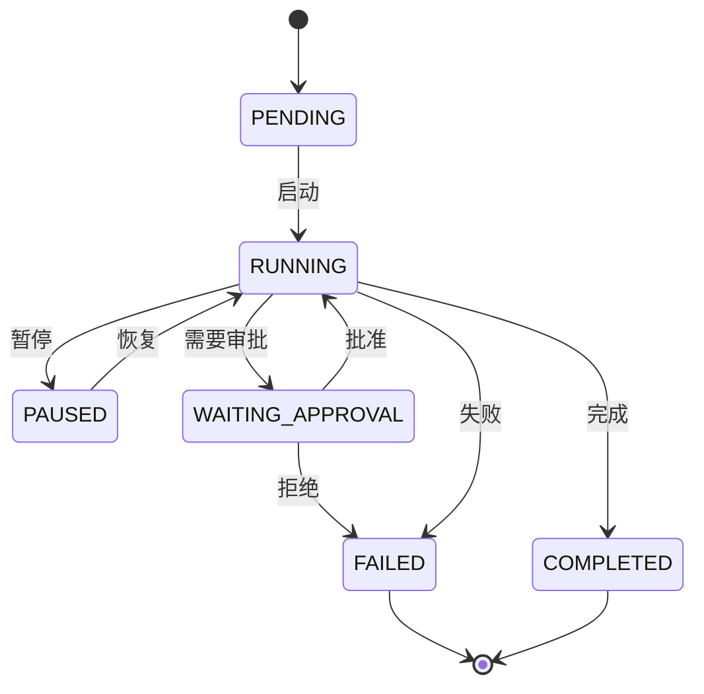

### 5. 类图 (Class Diagram)

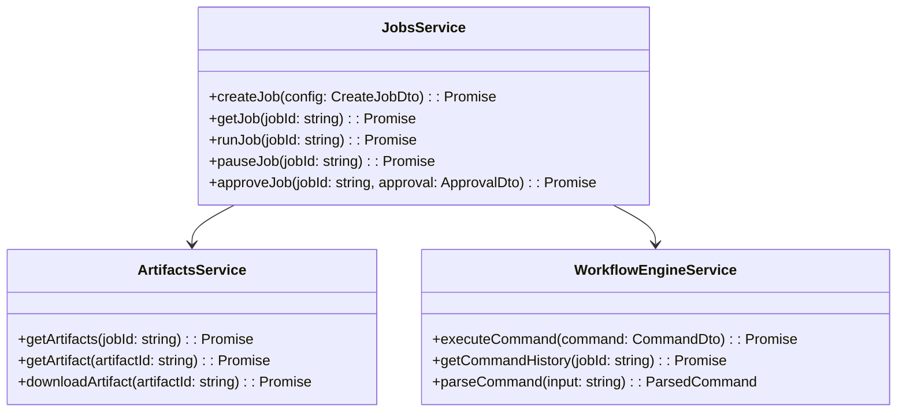

### 6. 甘特图 (Gantt Chart)

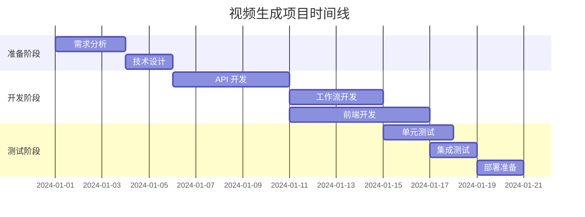

## 🎨 图表样式定制

### 主题配置

Mermaid 支持多种主题：

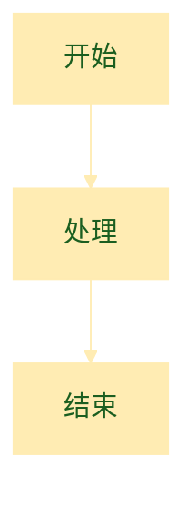

### 节点样式

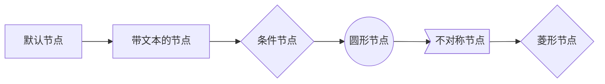

### 连接线样式

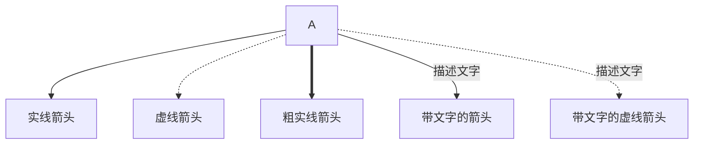

## 📝 最佳实践

### 1. 保持简洁
- 避免过于复杂的图表
- 合理分组和分层
- 使用清晰的命名

### 2. 一致性
- 统一的颜色方案
- 一致的节点形状
- 标准化的布局方向

### 3. 可读性
- 适当的字体大小
- 合理的间距
- 必要的注释说明

### 4. 维护性
- 模块化设计
- 易于修改的结构
- 清晰的代码格式

## 🔧 在文档中使用

### Markdown 语法

```markdown
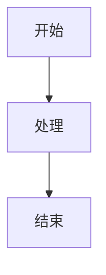
```

### 注意事项

1. **代码块标记**: 使用 `mermaid` 作为语言标识
2. **缩进**: 保持代码块内的正确缩进
3. **语法**: 遵循 Mermaid 语法规范
4. **兼容性**: 确保图表在不同主题下都能正常显示

## 🎯 实际应用示例

### API 调用流程

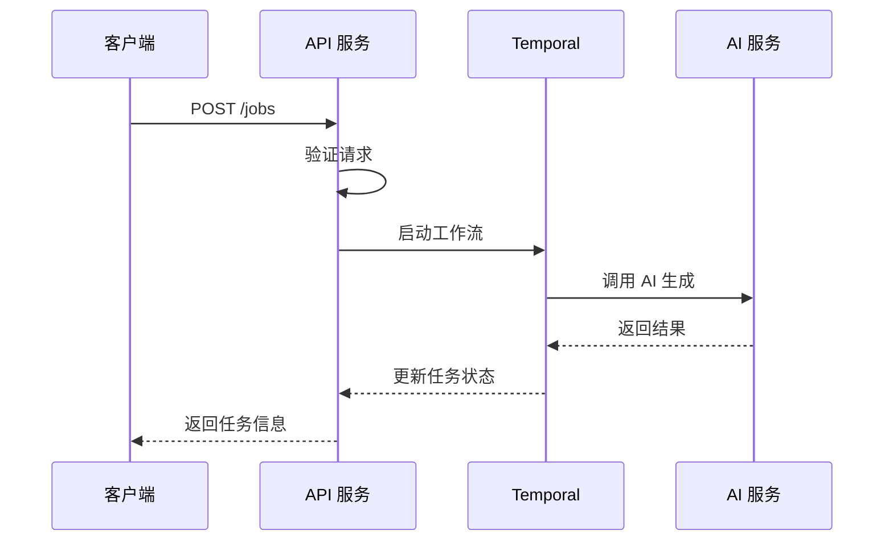

### 系统架构图

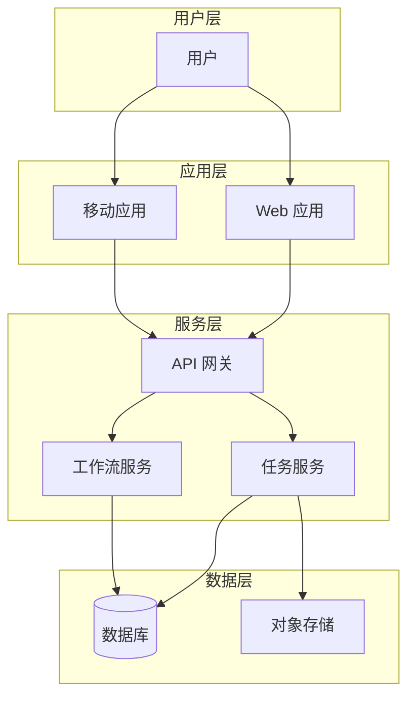

---

📖 **更多资源**: 
- [Mermaid 官方文档](https://mermaid.js.org/)
- [图表语法参考](https://mermaid.js.org/intro/n00b-syntaxReference.html)
- [主题配置指南](https://mermaid.js.org/config/theming.html)
