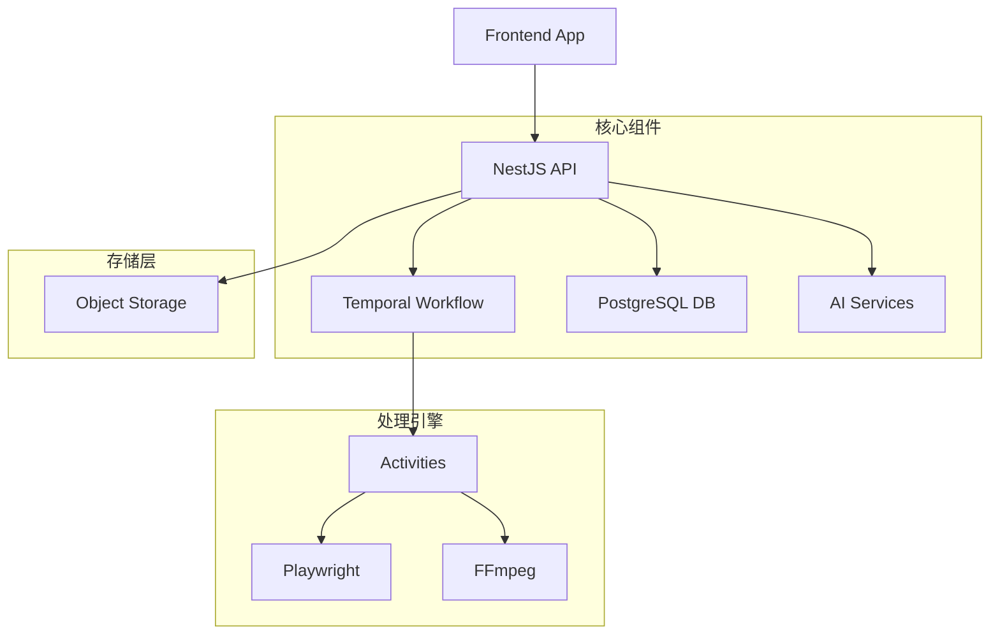

## 🎯 项目概述

Rematrix Server 是一个强大的后端服务，专门用于将 Markdown 文档转换为带字幕的讲解视频。系统采用现代化的微服务架构，集成了 AI 能量、工作流编排和实时通信技术。

### 核心功能

- 📝 **Markdown 解析**: 智能解析文档结构，生成工作计划
- 🎬 **视频生成流程**: 拆解文档生成大纲、分镜脚本、口播稿
- 🤖 **AI 集成**: 使用 OpenRouter 和 Vercel AI SDK 进行智能内容生成
- ⚡ **工作流编排**: 基于 Temporal 的可靠任务调度和状态管理
- 🔄 **实时通信**: SSE 实时推送和审批流程
- 📁 **对象存储**: 支持 Bunny Storage 等云存储服务

## 🏗️ 技术架构



## 📋 文档导航

### 🔌 API 接口
- [Jobs API](./api/jobs.md) - 任务管理和控制
- [Artifacts API](./api/artifacts.md) - 产物查询和管理  
- [Workflow Engine API](./api/workflow-engine.md) - 工作流指令执行
- [Chat SSE API](./api/chat-sse.md) - 实时对话和通信

### 🏛️ 架构设计
- [NestJS 架构](./architecture/nestjs.md) - 框架设计和模块结构
- [Temporal 工作流](./architecture/temporal.md) - 编排引擎和状态管理

### 📖 开发指南
- [快速开始](./quick-start.md) - 5分钟上手教程
- [部署指南](./deployment.md) - 生产环境部署方案

## 🚀 快速体验

### 1. 本地启动

```bash
# 克隆项目
git clone <repository-url>
cd rematrix-server/docs

# 安装依赖
npm install

# 启动文档服务
npm run dev
```

### 2. 核心 API 示例

```typescript
// 创建任务
const job = await fetch('http://localhost:3000/jobs', {
  method: 'POST',
  headers: { 'Content-Type': 'application/json' },
  body: JSON.stringify({
    config: {
      markdown: '# 你的 Markdown 内容'
    }
  })
});

// 启动工作流
await fetch(`http://localhost:3000/jobs/${jobId}/run`, {
  method: 'POST'
});
```

### 3. 实时通信

```typescript
// 建立 SSE 连接
const eventSource = new EventSource(`/jobs/${jobId}/chat/sse`);

eventSource.addEventListener('message', (event) => {
  const data = JSON.parse(event.data);
  console.log('AI 回复:', data.delta);
});
```

---

<div style="text-align: center; margin-top: 2rem;">
  <p style="color: var(--vp-c-text-2);">
    📖 详细文档请查看左侧导航栏 | 🚀 开始构建你的视频生成应用
  </p>
</div>
